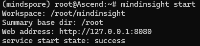
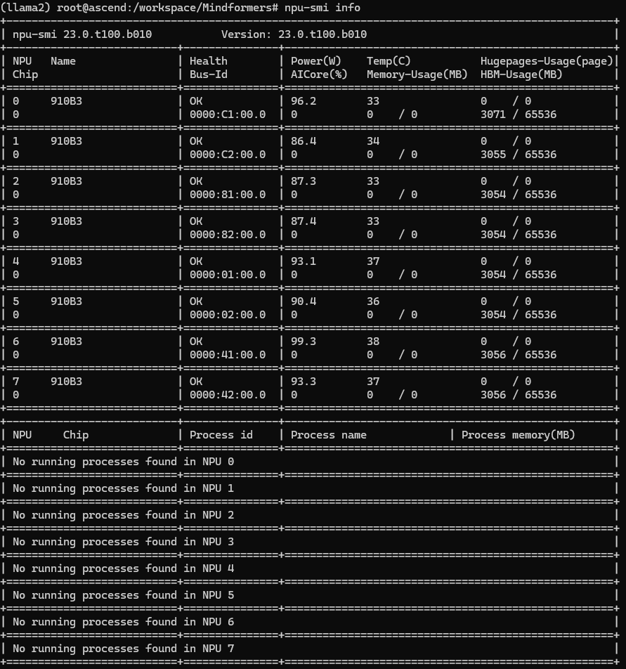

# 1. 快速使用

仓库中自带了`CANN 7.0.0`、`CANN 7.0.1`和`CANN 8.0.RC2`三个版本的容器创建脚本，准备好需要安装的包之后可以使用如下面命令可以快速创建并初始化容器的内容。

## 1.1 下载对应的软件包

如果想要以上命令能正常生效，请确保需要的软件已经储存在指定的目录中：

- software/
  - common/
    - [mpich-4.2.0.tar.gz](https://www.mpich.org/static/downloads/4.2.0/mpich-4.2.0.tar.gz)
    - [Anaconda3-2024.02-1-Linux-aarch64.sh](https://repo.anaconda.com/archive/Anaconda3-2024.02-1-Linux-aarch64.sh)
  - cann7.0.0/
    - [Ascend-cann-toolkit_7.0.0_linux-aarch64.run](https://www.hiascend.com/developer/download/community/result?module=cann)
    - [Ascend-cann-kernels-910b_7.0.0_linux.run](https://www.hiascend.com/developer/download/community/result?module=cann)
  - cann7.0.1/
    - [Ascend-cann-kernels-910b_7.0.1_linux.run](https://www.hiascend.com/developer/download/community/result?module=cann)
    - [Ascend-cann-toolkit_7.0.1_linux-aarch64.run](https://www.hiascend.com/developer/download/community/result?module=cann)
  - cann8.0.rc2/
    - [Ascend-cann-kernels-910b_8.0.RC2.alpha001_linux.run](https://www.hiascend.com/developer/download/community/result?module=cann)
    - [Ascend-cann-toolkit_8.0.RC2.alpha001_linux-aarch64.run](https://www.hiascend.com/developer/download/community/result?module=cann)
  - mindspore2.2.11/
    - [mindspore-2.2.11-cp39-cp39-linux_aarch64.whl](https://www.mindspore.cn/versions)
  - mindspore2.2.14/
    - [mindspore-2.2.14-cp39-cp39-linux_aarch64.whl](https://www.mindspore.cn/versions)
  - mindspore2.3.0rc1/
    - [mindspore-2.3.0rc1-cp39-cp39-linux_aarch64.whl](https://www.mindspore.cn/versions)
  - torch2.1.0/
    - [torch_npu-2.1.0.post3-cp310-cp310-manylinux_2_17_aarch64.manylinux2014_aarch64.whl](https://gitee.com/ascend/pytorch/releases)

## 1.2 快速创建容器

准备后以上路径和软件后，直接按照如下命令执行即可创建容器，并在容器内执行初始化任务，更新并安装需要的环境。

```bash
# 创建名为：test-cann8.0.rc2的容器
bash ./create.sh "test" "cann8.0.rc2"
# 初始化容器内的环境（在容器内执行）
bash install.sh && source ~/.bashrc
```

# 2. 容器创建

## 2.1 基础环境配置

### 2.1.1 更新apt包

相关的命令参考[script/install.sh](./script/install.sh)，完成apt更新后会自动安装一些必要的三方包，包括openssh-server、git、git-lfs、make、gcc等工具

```bash
# 最新脚本内容参考script/install.sh文件
apt update && apt upgrade -y
apt install -y git git-lfs nano openssh-server openssl 
apt install -y gcc g++ gdb make cmake net-tools iproute2 
apt install -y autoconf automake unzip pciutils gfortran 
apt install -y zlib1g zlib1g-dev libsqlite3-dev libssl-dev 
apt install -y libtool libffi-dev libblas-dev libblas3
```

### 2.1.2 修改配置文件

把一些自定义bash命令灌入`~/.bashrc`文件中，修改ssh的配置文件，将host的authorized_keys复制到docker

```bash
cat /root/script/bashrc >> ~/.bashrc
cat /root/script/sshd_config >> /etc/ssh/sshd_config
cat /root/.ssh/authorized_keys.host >> ~/.ssh/authorized_keys
```

### 2.1.3 安装mpich包

将准备的mpich-4.2.0安装包放置在software/common路径下，执行编译与安装命令

```bash
MPICH_TAR="path/to/mpich-*.tar.gz"

cd && mkdir /root/mpich
cp ${MPICH_TAR} mpich_tmp.tar.gz
tar -zvxf mpich_tmp.tar.gz && rm mpich_tmp.tar.gz
cd mpich-* && ./configure -prefix=/root/mpich --disable-fortran
make -j 32 && make install
cd .. && rm -rf mpich-*
```

完成mpich的安装后可以使用如下命令测试安装结果。（如下命令依赖Ascend系列的工具包，请在完成Ascend工具包安装后执行验证）

```bash
source /root/script/bashrc
cd /usr/local/Ascend/ascend-toolkit/latest/tools/hccl_test
make ASCEND_DIR=/usr/local/Ascend/ascend-toolkit/latest
mpirun -n 8 ./bin/all_reduce_test -b 2048M -e 2048M -f 2 -p 8 && cd
```

## 2.2 安装Anaconda

为了解决多种模型和MindSpore对Python版本的需求不一致的问题，安装安装Anaconda创建虚拟Python环境解决该问题。

### 2.2.1 下载Anaconda

进入Anaconda的官网获取最新版本的conda安装链接，并如下命令安装Anaconda（下载Anaconda时需要注意对应的版本号和芯片架构类型，例如在Ascend上就是ARM64架构）

```bash
# 从官网获取下载链接：https://www.anaconda.com/download#downloads
wget https://repo.anaconda.com/archive/Anaconda3-xxx.sh
# 安装Anaconda
bash Anaconda3-2024.02-1-Linux-aarch64.sh
# 刷新环境变量，否则无法启用conda命令
source ~/.bashrc
```

### 2.2.2 Conda常见命令

1. 查看全部的环境：`conda env list`
2. 激活指定环境：`conda activate <name>`
3. 创建新的环境：`conda create -n <name> python=<3.7.11>`
4. 删除指定环境：`conda remove -n <name> --all`

### 2.2.3 创建Conda环境

使用如下命令创建一个名为`mindspore`的Python环境，后续的所有操作都在该环境下进行

```bash
# 创建适用于mindspore的虚拟环境（如果已经存在则无需重复创建）
conda create -n mindspore python=3.7.11
# 进入虚拟环境
conda activate mindspore
```

### 2.2.4 快速安装

完成anaconda的安装后需要执行以下conda init，由于~/.bashrc文件不支持在脚本中调用，因此完成安装后需要手动source一次conda的环境变量以生效安装。

```bash
CONDA_PKG="path/to/Anaconda-*.sh"

bash ${CONDA_PKG} -b
/root/anaconda3/bin/conda init
source /root/script/conda
pip install -r /root/script/requirements.txt -i https://pypi.tuna.tsinghua.edu.cn/simple
```

## 2.3 安装Ascend

安装CANN之前需要确保NPU的驱动和固件已经完成安装，此步骤一般宿主机已完成，通过docker挂载到容器内部，可以正常使用

### 2.3.1 设备检查

首先使用如下命令确定NPU已成功挂载到服务器上

```bash
lspci | grep accelerators
```

在[昇腾社区](https://www.mindspore.cn/versions)中搜索对应的CANN版本，并下载，选择版本时请选择开发套件`toolkit`，文件格式为`*.run`，下载完成后使用FTP或SFTP等工具将文件传输至服务器中

### 2.3.2 安装依赖

在安装CANN之前需要安装一些必要的工具包，安装命令如下所示（以Ubuntu系统为例）

```bash
# 安装必备组件
apt install -y nano gcc g++ make cmake zlib1g zlib1g-dev openssl libsqlite3-dev libssl-dev libffi-dev unzip pciutils net-tools libblas-dev gfortran libblas3
```

使用`python --version`检查Python的版本，根据官网的要求，CANN要求的Python版本范围是：`python3.7.5~3.7.11`、`python3.8.0~3.8.11`、`python3.9.0~3.9.7`和`python3.10.0~3.10.12`，如果Python版本不匹配，则需要使用Anaconda创建对应版本的虚拟环境。

使用pip安装必要的依赖包：

```bash
pip install attrs numpy decorator sympy cffi pyyaml pathlib2 psutil protobuf scipy requests absl-py wheel typing_extensions
```

### 2.3.3 安装CANN

将下载的`*.run`文件通过FTP或SFTP等方式上传到服务器上，然后按照如下命令安装CANN开发包

```bash
# 修改文件的可执行权限
chmod +x ./Ascend-cann-toolkit_7.0.0_linux-aarch64.run
# 开始安装CANN工具包
./Ascend-cann-toolkit_7.0.0_linux-aarch64.run --install
# 配置环境变量
source /usr/local/Ascend/ascend-toolkit/set_env.sh
```

> 这里使用的CANN版本为7.0.0，在选择版本时需要与MindSpore版本一致，也需要与Mindformers版本一致，否则将导致不可预料的问题。CANN与MindSpore版本匹配查询[网站](https://www.mindspore.cn/versions#ascend配套软件包)

### 2.3.4 快速安装

将Ascend开发工具直接安装到对应的目录中即可，需要注意的是，安装之后手动调用bashrc文件，以生效安装过程

```bash
ASCEND_TOOLKIT="path/to/Ascend-*.run"
ASCEND_KERNEL="path/to/Ascend-*.run"

${ASCEND_TOOLKIT} --quiet --install && source /root/script/bashrc
${ASCEND_KERNEL} --quiet --install && source /root/script/bashrc
```

## 2.4 安装AI框架

安装必备的AI框架，包括Mindspore、pytorch、Mindformers等，在安装的过程中需要注意版本对应关系，不同的框架可能根据需要安装在不用的conda环境中

### 2.4.1 安装Mindspore

可以从源码或者pip两种方式安装Mindspore，这里以pip安装的方式为主，使用源码的方式安装minspore的过程请参考其他教程

Mindspore可以使用pip直接安装，安装过程参考[Mindspore](https://gitee.com/mindspore/mindspore)，pip安装的Mindspore版本参考如该[网站](https://www.mindspore.cn/versions)

```bash
# 从以下网站获取对应的pip包网址
# https://www.mindspore.cn/versions
wget https://ms-release.obs.cn-north-4.myhuaweicloud.com/2.2.11/MindSpore/unified/aarch64/mindspore-2.2.11-cp37-cp37m-linux_aarch64.whl
# 使用pip安装
pip install mindspore-2.2.11-cp37-cp37m-linux_aarch64.whl
```

使用如下命令验证Mindspore的安装结果

```bash
python -c "import mindspore;mindspore.set_context(device_target='Ascend');mindspore.run_check()"
```

### 2.4.2 安装Pytorch

参考链接：[hiascend](https://www.hiascend.com/developer/techArticles/20230526-1?envFlag=1)、[gitee](https://gitee.com/ascend/pytorch)、[pytorch](https://pytorch.org/get-started/locally)

首先创建torch环境，并激活，建议的python版本为3.10

```bash
# 创建环境
conda create -n torch2.1.0 python=3.10 -y
conda activate torch
```

使用pip安装依赖项和CPU版本的Torch

```bash
# 安装依赖
pip install tornado cloudpickle attrs numpy decorator sympy cffi pyyaml pathlib2 psutil protobuf scipy requests absl-py wheel typing_extensions
# 安装CPU版本的torch包，版本号需要与NPU版的一致
pip install torch==2.1.0 --index-url https://download.pytorch.org/whl/cpu
```

安装Ascend工具包，需要安装对应的Kernels包，否则无法正常运行torch

```bash
# 安装NPU版本的torch包
wget https://gitee.com/ascend/pytorch/releases/download/v6.0.rc1-pytorch2.1.0/torch_npu-2.1.0.post3-cp310-cp310-manylinux_2_17_aarch64.manylinux2014_aarch64.whl
pip install ./torch_npu-2.1.0.post3-cp310-cp310-manylinux_2_17_aarch64.manylinux2014_aarch64.whl
```

验证安装结果

```bash
# 验证安装结果
python -c "import torch;import torch_npu; a = torch.ones(3, 4).npu(); print(a + a);"
```

### 2.4.3 安装Mindformers

可以使用git下载[Mindformers的源码](https://gitee.com/mindspore/mindformers)，然后使用自带的构建工具构建Mindformers环境，但是由于版本依赖问题，不是很推荐使用这种方法，建议使用pip安装对应版本的包

在官方[安装页面](https://www.mindspore.cn/versions)找到与Mindspore版本一致的Mindformers安装包，下载并安装即可

```bash
# 下载Mindformers
wget https://ms-release.obs.cn-north-4.myhuaweicloud.com/2.2.11/MindFormers/any/mindformers-1.0.0-py3-none-any.whl
# 安装Mindformers
pip install mindformers-1.0.0-py3-none-any.whl
```

### 2.4.4安装Mindinsight

Mindinsight可以帮助分析使用Mindspore构建的应用的性能等信息，使用教程参考[官方连接](https://www.mindspore.cn/mindinsight/docs/zh-CN/master/index.html)，使用pip直接安装Mindinsight即可，但是需要注意其版本应与Mindspore版本一致。（使用pip的安装时间很长，且中间可能会出现卡死的情况，请耐心等待安装完成）

```bash
# 使用pip安装Mindinsight
pip install mindinsight
```

使用如下命令验证Mindinsight的安装结果

```bash
mindinsight start
```



# 3. 附录

## 3.1 docker命令

### 3.1.1 常用的docker命令

1. 显示全部的镜像：`docker images`
2. 创建一个容器：`docker run ...`<查看4.1.2节内容>
3. 显示全部的容器：`docker ps -a`
4. 启动一个容器：`docker start <id>`
5. 停止一个容器：`docker stop <id>`
6. 进入一个正在运行的程序：`docker exec -it <id> /bin/bash`
7. 删除一个容器：`docker rm <id>`

### 3.1.2 创建容器

创建一个docker容器的时候需要同时挂载本地工作目录和相关的程序驱动，因此创建docker容器的命令参数较多，以下为一个创建docker容器命令的基本格式：

```bash
docker run -it --ipc=host --name <name> -v <local_path>:<docker_path>  \
    --workdir=<docker_path> \
    --pids-limit 409600 \
    --privileged --network=host \
    --shm-size=128G \
    --device=/dev/davinci0 \
    --device=/dev/davinci1 \
    --device=/dev/davinci2 \
    --device=/dev/davinci3 \
    --device=/dev/davinci4 \
    --device=/dev/davinci5 \
    --device=/dev/davinci6 \
    --device=/dev/davinci7 \
    --device=/dev/davinci_manager \
    --device=/dev/devmm_svm \
    --device=/dev/hisi_hdc \
    -v /usr/local/Ascend/driver:/usr/local/Ascend/driver \
    -v /usr/local/Ascend/firmware:/usr/local/Ascend/firmware \
    -v /usr/local/Ascend/add-ons/:/usr/local/Ascend/add-ons/ \
    -v /usr/local/bin/npu-smi:/usr/local/bin/npu-smi \
    -v /usr/local/dcmi:/usr/local/dcmi \
    -v /etc/ascend_install.info:/etc/ascend_install.info \
    -v /etc/bashrc:/etc/bashrc \
    -p 223:223 \
    -p 224:6006 \
    -p 225:8080 \
    -p 226:8888 \    
    -u root \
    <image_id> /bin/bash
```

- `-it`：已交互方式运行容器，并分配一个终端
- `-ipc=host`：用于docker内部进程与宿主机进程的通信
- `--name` <name>：指定要创建的容器的名字
- `-v <local_path>:<docker_path>`：挂载本地的`<local_path>`路径到容器中的`<docker_path>`路径
- `--workdir=<docker_path>`：重定向容器的工作路径到`<docker_path>`路径
- `--pids-limit 409600`：<**可省略**>对容器内可以运行的进程数量限制
- `--privileged`：使容器内的root具有容器外部root的权限
- `--network=host`：指定容器的网络与宿主机相同
- `--shm-size=128G`：<**可省略**>修改共享内存的大小
- `--device=<device>`：挂载硬件设备
- `-v /usr/local/Ascend/driver:/usr/local/Ascend/driver`：[**NPU**]挂载NPU驱动
- `-v /usr/local/Ascend/firmware:/usr/local/Ascend/firmware`：[**NPU**]挂载Firmware
- `-v /usr/local/Ascend/add-ons/:/usr/local/Ascend/add-ons/`：[**NPU**]挂载NPU工具包
- `-v /usr/local/bin/npu-smi:/usr/local/bin/npu-smi`：[**NPU**]挂载npu-smi命令
- `-v /usr/local/dcmi:/usr/local/dcmi`：[**NPU**]挂载DCMI
- `-v /etc/ascend_install.info:/etc/ascend_install.info`：[**NPU**]挂载安装信息
- `-v /etc/bashrc:/etc/bashrc`：添加bash命令行的内容
- `-p 223:223`：挂载端口，用于使用ssh直接登录docker容器内部
- `-p 224:6006`：挂载端口，将TensorBoard端口映射到宿主
- `-p 225:8080`：挂载端口，将MindInsight端口映射到宿主
- `-p 226:8888`：挂载端口，将Jupyter端口映射到宿主
- `-u root`：以root身份进入容器
- `<image_id>`：要创建容器的镜像ID，可通过`docker images`查看
- `/bin/bash`：进入容器后执行的命令，默认进入控制台

完成容器创建后可以通过`npu-smi info`命令查看NPU状态是否正常，若NPU正常挂载，则会输出NPU的数量、状态等基本信息。



## 3.2 配置SSH

为了使用外部IDE（VSCode或MindStudio等）连接Docker内的编译环境，需要使用SSH将容器内的操作系统通过SSH映射到外部

### 3.2.1 安装SSH-Server

需要安装SSH Server，并修改管理员密码，或配置SSH-Key登录的方式登录到Docker内部

```bash
# 更新apt
apt update
# 安装SSH-Server和Nano编辑器
apt install -y nano openssh-server
```

### 3.2.2 修改SSH配置

使用如下命令修改Docker内部root用户的密码

```bash
passwd
# 修改成功后会有如下显示
# passwd: password updated successfully
```

使用nano（也可以使用vi）修改ssh的配置信息

```bash
nano /etc/ssh/sshd_config
```

- 新增`Port 223`，这里的端口号应该与创建容器时的一致
- 新增`PermitRootLogin yes`
- 新增`PubkeyAuthentication yes`

然后使用如下命令启动ssh并查看ssh的状态

```bash
# 启动ssh
service ssh start
# 查看ssh的状态
service ssh status
```

### 3.2.3 添加SSH密钥

为了方便后续使用IDE连接docker，建议配置SSH密钥以实现免密登录，使用`ssh-keygen`命令在本地生成公钥和私钥，并将公钥的内容复制到Docker内

```bash
nano ~/.ssh/authorized_keys
```

## 3.3 环境变量

使用ssh登录到docker容器内时，`npu-smi info`命令可能出现无法使用的情况，可根据错误提示按照如下方法解决该问题

- npu-smi: error while loading shared libraries: libdrvdsmi_host.so: cannot open shared object file: No such file or directory

  如果出现该错误是因为相关的环境变量未成功添加到终端，可按照如下方法添加

  ```bash
  # 使用nano修改~/.bashrc文件
  nano ~/.bashrc
  # 在最后一行添加如下内容
  source /usr/local/Ascend/ascend-toolkit/set_env.sh
  ```

- npu-smi: error while loading shared libraries: libdrvdsmi_host.so: cannot open shared object file: No such file or directory

  如果出现该错误是NPU驱动相关的环境变量未添加，可按照如下方法添加

  ```bash
  # 查找文件所在的路径
  find / -name libdrvdsmi_host.so
  # 将文件路径添加到环境变量中
  export LD_LIBRARY_PATH=/usr/local/Ascend/driver/lib64/driver/:$LD_LIBRARY_PATH
  ```

为了方便在每一次打开终端时都可以正常运行npu-smi指令，可以将以上内容添加到`~/.bashrc`文件中

```bash
# 编辑~/.bashrc文件
nano ~/.bashrc
```

- 添加`source /usr/local/Ascend/ascend-toolkit/set_env.sh`
- 添加`source /usr/local/Ascend/driver/bin/setenv.bash`
- 添加`export PATH=/usr/local/Ascend/driver/tools/:$PATH`
- 添加`export LD_LIBRARY_PATH=/usr/local/Ascend/add-ons/:$LD_LIBRARY_PATH`

完成添加后，使用`source ~/.bashrc`命令重新装载`.bashrc`文件生效
